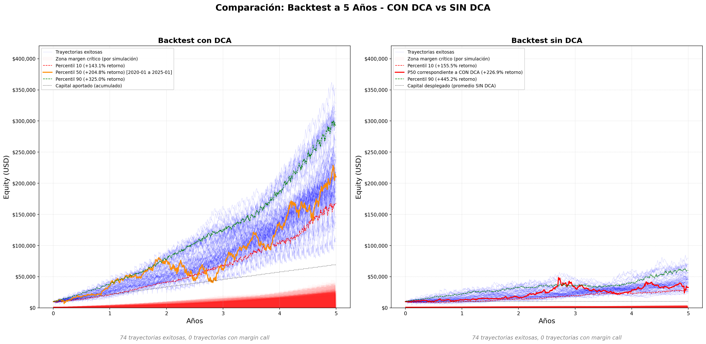
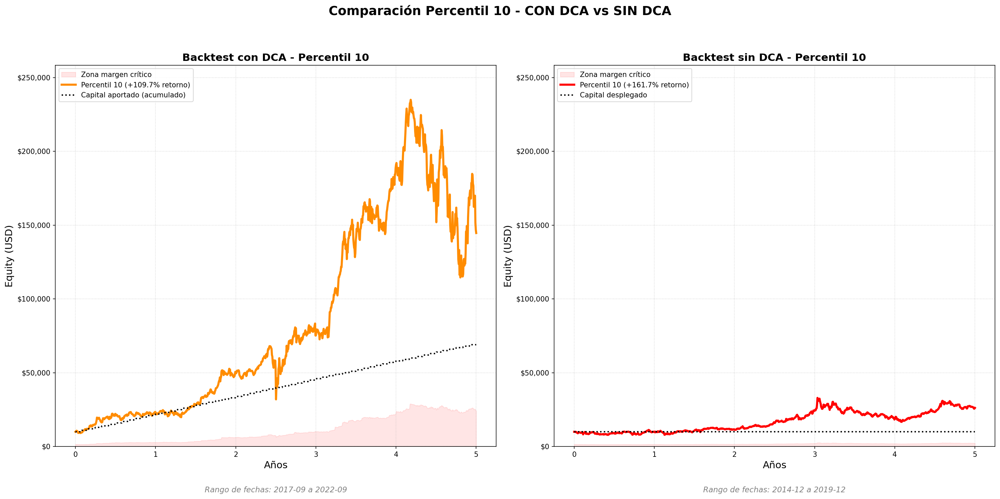
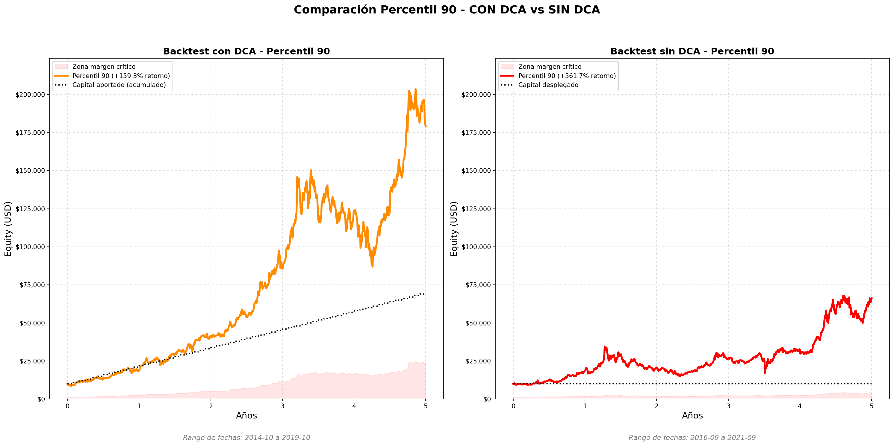

# 📈 TrendSim-Leveraged-Portfolio

## Evaluación de Riesgo y Optimización de Cartera Apalancada mediante Simulación Monte Carlo y Backtest Histórico

Este proyecto es una herramienta de análisis cuantitativo diseñada para evaluar y optimizar carteras de inversión apalancadas (como las utilizadas en plataformas tipo Quantfury). El objetivo central es encontrar la asignación de activos que **maximice el Sharpe Ratio apalancado** mientras se implementa una **estrategia de gestión de riesgo activa** para mitigar la probabilidad de un *Margin Call* (liquidación).

El enfoque se basa en el **muestreo de tendencias históricas** para preservar la estructura de mercado (momentum y *volatility clustering*) y simular un comportamiento más realista que los modelos basados en caminatas aleatorias (Geometric Brownian Motion).

-----

## ⚙️ Estructura del Repositorio

El proyecto consta de dos *notebooks* principales que trabajan de forma complementaria:

| Archivo | Tipo de Análisis | Descripción |
| :--- | :--- | :--- |
| **`MonteCarloSimulator.ipynb`** | **Simulación y Optimización** | Flujo completo que realiza la optimización de pesos (Max Sharpe) y ejecuta miles de simulaciones Monte Carlo. Es el módulo principal para la **proyección de riesgo y rentabilidad a 5 años** con la estrategia activa de DCA condicional. |
| **`BacktestHistorical.ipynb`** | **Backtest Comparativo** | Módulo de validación que compara la **estrategia ACTIVA (CON DCA condicional)** frente a una **estrategia PASIVA (SIN DCA)** mediante el uso de múltiples ventanas deslizantes de 5 años. Confirma el valor de la gestión activa en periodos históricos específicos. Incluye análisis detallado de métricas de proximidad al margin call y visualizaciones comparativas para P10, P50 y P90 basadas en Sharpe Ratio. |

-----

## 🎯 Metodología Clave: Innovación y Realismo

La precisión de las proyecciones se basa en dos componentes metodológicos cruciales:

### 1\. Simulación con Preservación de Momentum (Trend Sampling)

Para superar las limitaciones del muestreo diario aleatorio (que destruye la estructura temporal y subestima el riesgo de *crashes* prolongados), se utiliza un muestreo de tendencias:

  * **Extracción de Tendencias:** El código analiza los datos históricos (e.g., 7 años) y extrae ventanas de tiempo (tendencias) donde el movimiento total superó un umbral (e.g., $\pm 5\%$).
  * **Muestreo con `TrendSampler`:** En lugar de seleccionar un día al azar, la simulación selecciona una **tendencia completa** al azar y reproduce sus días consecutivos (*momentum*). Una vez que la tendencia termina, se selecciona otra.
  * **Corrección de Sesgo:** Se aplica un **Factor de Escalamiento Aritmético** a los retornos muestreados para asegurar que la volatilidad total simulada coincida con la volatilidad histórica de referencia, corrigiendo el sesgo de subrepresentación de días "neutrales" introducido por la extracción de solo tendencias extremas.

### 2\. Estrategia de DCA Condicional y Antirriesgo

La aportación mensual (`$1,000 USD`) no se despliega automáticamente, sino que funciona como un **buffer de capital** que se utiliza de forma condicional, priorizando la seguridad:

  * **Análisis de Margen Crítico:** Antes de desplegar capital, se evalúa el **Ratio de Margen Actual** ($\text{Equity} / \text{Exposure}$). Si el ratio cae por debajo de un umbral crítico (`CRITICAL_MARGIN_RATIO`, típicamente 10%), el $100\%$ del DCA se mantiene como *cash buffer* para proteger contra el *margin call*.
  * **Despliegue Gradual:** El capital solo se despliega (para aumentar el apalancamiento y rebalancear) si se cumplen condiciones de mercado favorables (e.g., *Drawdown* severo, alta **Desviación de Pesos** respecto al óptimo o **Volatilidad Realizada Baja**).
  * **Prioridad:** La estrategia prioriza la reducción del riesgo de liquidación sobre la maximización del crecimiento inmediato.

-----

## 📊 Métricas y Resultados Reportados

Ambos *notebooks* calculan y reportan las siguientes métricas clave para evaluar la estrategia:

| Métrica | Descripción | Enfoque de Riesgo |
| :--- | :--- | :--- |
| **Probabilidad de Margin Call** | Porcentaje de simulaciones (a 1 y 5 años) que resultan en la liquidación del capital. | Riesgo Extremo ($\text{Tail Risk}$). |
| **Capital Final y Percentiles (P10, P50, P90)** | La dispersión del capital final a 5 años, con un enfoque en el $\text{P10}$ (escenario adverso). Los percentiles se seleccionan basándose en el **Sharpe Ratio** de cada simulación, no solo en el capital final, para capturar mejor la relación riesgo-retorno. | Rendimiento Proyectado. |
| **IRR (Internal Rate of Return)** | Rentabilidad anualizada, considerando los flujos de caja reales (inversión inicial + aportaciones mensuales). | Rentabilidad Comparable. |
| **Max Drawdown Equity (%)** | Máxima caída porcentual del capital (Equity) desde su pico histórico en cada trayectoria. | Riesgo de Mercado. |
| **Max Drawdown Exposure (%)** | Máxima caída porcentual de la exposición total (Exposure) desde su pico histórico. Esta métrica ayuda a entender si las caídas del equity están acompañadas de caídas proporcionales en la exposición. | Riesgo de Mercado. |
| **Margen Ratio en Max Drawdown (%)** | Ratio de margen (equity/exposure) en el momento del máximo drawdown del equity. Valores altos (>20%) indican margen saludable incluso en el peor momento. | Gestión de Riesgo de Liquidación. |
| **Leverage Efectivo en Max Drawdown (x)** | Leverage efectivo (exposure/equity) en el momento del máximo drawdown del equity. | Gestión de Riesgo de Liquidación. |
| **Sharpe Ratio** | Relación entre el retorno excedente (sobre la tasa libre de riesgo) y la volatilidad, calculado individualmente para cada trayectoria. | Eficiencia del Capital. |
| **Días Bajo el Agua** | Número total de días donde el equity está por debajo del capital total invertido acumulado (inversión inicial + aportaciones). | Medición de Rendimiento vs. Inversión. |
| **Métricas de Proximidad al Margin Call** | Conjunto de métricas que evalúan qué tan cerca estuvo la estrategia de un margin call: | Gestión de Riesgo de Liquidación. |
| &nbsp;&nbsp;• **Margen Mínimo Buffer (%)** | Diferencia mínima entre el ratio de margen actual y el umbral de mantenimiento. Indica el "colchón" de seguridad más estrecho alcanzado. | |
| &nbsp;&nbsp;• **Margen Mínimo (%)** | El ratio de margen mínimo alcanzado durante toda la simulación (equity/exposure). Valores bajos indican mayor leverage efectivo y mayor riesgo. | |
| &nbsp;&nbsp;• **Días Bajo Margen Crítico** | Número de días donde el ratio de margen estuvo por debajo del umbral crítico (``CRITICAL_MARGIN_RATIO``). | |
| &nbsp;&nbsp;• **Días de Supervivencia** | Días hasta el margin call (si ocurrió) o total de días si la simulación sobrevivió. | |
| &nbsp;&nbsp;• **Drawdown al Margin Call (%)** | El drawdown adicional que podría ocurrir antes de alcanzar el umbral de margin call. | |

-----

## 📈 Análisis de Resultados del Backtest Histórico

Esta sección presenta un análisis detallado de los resultados del backtest histórico comparando la estrategia **CON DCA** (activa) versus **SIN DCA** (pasiva), basado en múltiples ventanas deslizantes de 5 años. En las **Figuras 2 y 3**, los resultados se seleccionaron usando **Sharpe Ratio** como criterio principal para cada percentil (P10, P50, P90), capturando mejor la relación riesgo-retorno que usar solo el capital final.

### Visualizaciones de Trayectorias

Las siguientes visualizaciones muestran las trayectorias de equity para diferentes percentiles:

**Nota importante sobre percentiles:** En la **Figura 1** (comparación de todas las trayectorias), las líneas **P10 y P90** representan los **percentiles de capital total en cada momento del tiempo**, no trayectorias individuales. Es decir, en cada día *t*, se calcula el percentil 10 y 90 de todas las trayectorias en ese momento. Por el contrario, la línea **P50** es una **trayectoria real seleccionada** basándose en el Sharpe Ratio de cada simulación completa. Las **Figuras 2 y 3** muestran trayectorias específicas seleccionadas basándose en el **Sharpe Ratio** (P10 y P90 respectivamente).



*Figura 1: Comparación completa de todas las trayectorias simuladas (74 exitosas, 0 margin calls). Las líneas P10 y P90 muestran los percentiles de capital en cada momento del tiempo (no trayectorias individuales), mientras que P50 es una trayectoria real seleccionada basándose en Sharpe Ratio. La estrategia CON DCA muestra una dispersión mucho mayor y un crecimiento significativamente superior.*



*Figura 2: Comparación de trayectorias específicas seleccionadas basándose en Sharpe Ratio (P10). CON DCA logra $144,666 (retorno +106.7%) vs SIN DCA con $26,117 (retorno +161.2% pero sobre capital mucho menor).*



*Figura 3: Comparación de trayectorias específicas seleccionadas basándose en Sharpe Ratio (P90). CON DCA alcanza $178,944 (retorno +155.6%) vs SIN DCA con $66,170 (retorno +561.7%).*

### Análisis de Rendimiento por Percentil

#### Percentil 10 (Escenario Adverso)

| Métrica | CON DCA | SIN DCA | Diferencia |
| :--- | :--- | :--- | :--- |
| **Capital Final** | $144,666 | $26,117 | **+$118,550** (+454%) |
| **Total Invertido** | $70,000 | $10,000 | - |
| **Retorno Total (%)** | +106.7% | +161.2% | -54.5 pp |
| **CAGR (%)** | 98.1% | 28.1% | **+70.0 pp** |
| **Sharpe Ratio** | 1.42 | 0.78 | **+0.64** |
| **Max Drawdown Equity (%)** | -53.0% | -46.0% | -7.0 pp |
| **Max Drawdown Exposure (%)** | -21.9% | -27.4% | +5.5 pp |
| **Margen Ratio en Max Drawdown (%)** | 25.1% | 44.3% | -19.2 pp |
| **Leverage Efectivo en Max Drawdown (x)** | 4.0x | 2.3x | +1.7x |
| **Días Bajo el Agua** | 1 (0.1%) | 163 (16.7%) | -162 días |
| **Margen Mínimo (%)** | 25.1% | 27.7% | -2.6 pp |
| **Días Bajo Margen Crítico** | 0 (0%) | 0 (0%) | 0 días |

**Análisis P10:**
- Aunque SIN DCA muestra un retorno porcentual mayor (+161.2% vs +106.7%), esto se debe a que invirtió **solo $10,000** vs $70,000 de CON DCA.
- CON DCA genera **$118,550 más** en capital final absoluto, demostrando el valor de las aportaciones regulares.
- CON DCA muestra un Sharpe Ratio significativamente superior (1.42 vs 0.78), indicando mucha mejor compensación riesgo-retorno.
- **Análisis de Drawdowns:** CON DCA tiene un max drawdown del equity de -53.0% vs -46.0% de SIN DCA. Sin embargo, el **drawdown de la exposición** es mucho menor: -21.9% vs -27.4%, mostrando que cuando el equity cae, la exposición también cae proporcionalmente debido al leverage efectivo (~4.0x). Esto explica por qué **no hay margin call** incluso con caídas del 53%: el margin ratio en el peor momento fue 25.1%, muy por encima del umbral crítico (10%) y de mantenimiento (5%).
- CON DCA recupera mucho más rápido (26 días vs 132 días).
- SIN DCA pasa 163 días bajo el agua (16.7% del tiempo) vs solo 1 día (0.1%) para CON DCA, mostrando la diferencia en sostenibilidad del crecimiento.

#### Percentil 50 (Escenario Mediano)

| Métrica | CON DCA | SIN DCA | Diferencia |
| :--- | :--- | :--- | :--- |
| **Capital Final** | $171,028 | $38,936 | **+$132,092** (+339%) |
| **Total Invertido** | $70,000 | $10,000 | - |
| **Retorno Total (%)** | +144.3% | +289.4% | -145.1 pp |
| **CAGR (%)** | 106.8% | 41.6% | **+65.2 pp** |
| **Sharpe Ratio** | 1.68 | 0.95 | **+0.73** |
| **Max Drawdown Equity (%)** | -53.8% | -55.4% | +1.6 pp |
| **Max Drawdown Exposure (%)** | -22.4% | -39.2% | +16.8 pp |
| **Margen Ratio en Max Drawdown (%)** | 24.9% | 51.9% | -27.0 pp |
| **Leverage Efectivo en Max Drawdown (x)** | 4.0x | 1.9x | +2.1x |
| **Días Bajo el Agua** | 1 (0.1%) | 1 (0.1%) | 0 días |
| **Margen Mínimo (%)** | 24.9% | 32.7% | -7.8 pp |
| **Días Bajo Margen Crítico** | 0 (0%) | 0 (0%) | 0 días |

**Análisis P50:**
- CON DCA supera ampliamente a SIN DCA con **+$132,092 adicionales** en capital final.
- Aunque SIN DCA muestra un retorno porcentual mayor (+289.4% vs +144.3%), esto se debe a que invirtió **solo $10,000** vs $70,000 de CON DCA.
- El Sharpe Ratio de CON DCA (1.68) es significativamente superior (77% mejor), confirmando mucha mejor eficiencia de capital.
- **Análisis de Drawdowns:** CON DCA tiene un max drawdown del equity de -53.8% vs -55.4% de SIN DCA. El **drawdown de la exposición** es mucho menor para CON DCA: -22.4% vs -39.2%. En el peor momento, CON DCA mantuvo un margin ratio de 24.9% con leverage efectivo de 4.0x, mientras que SIN DCA tuvo un margin ratio de 51.9% con leverage de solo 1.9x. Esto muestra que CON DCA opera con mayor leverage pero mantiene márgenes saludables porque la exposición también cae cuando el equity cae.
- CON DCA recupera mucho más rápido (11 días vs 263 días).
- Ambas estrategias muestran **0 margin calls** y margen mínimo saludable (>24% para ambas).

#### Percentil 90 (Escenario Óptimo)

| Métrica | CON DCA | SIN DCA | Diferencia |
| :--- | :--- | :--- | :--- |
| **Capital Final** | $178,944 | $66,170 | **+$112,774** (+170%) |
| **Total Invertido** | $70,000 | $10,000 | - |
| **Retorno Total (%)** | +155.6% | +561.7% | -406.1 pp |
| **CAGR (%)** | 109.3% | 62.2% | **+47.1 pp** |
| **Sharpe Ratio** | 1.95 | 1.21 | **+0.74** |
| **Max Drawdown Equity (%)** | -42.1% | -56.4% | +14.3 pp |
| **Max Drawdown Exposure (%)** | -15.1% | -35.7% | +20.6 pp |
| **Margen Ratio en Max Drawdown (%)** | 28.7% | 43.0% | -14.3 pp |
| **Leverage Efectivo en Max Drawdown (x)** | 3.5x | 2.3x | +1.2x |
| **Días Bajo el Agua** | 25 (2.5%) | 1 (0.1%) | +24 días |
| **Margen Mínimo (%)** | 28.7% | 31.7% | -3.0 pp |
| **Días Bajo Margen Crítico** | 0 (0%) | 0 (0%) | 0 días |

**Análisis P90:**
- En el mejor escenario, CON DCA genera **+$112,774 adicionales** respecto a SIN DCA.
- Aunque SIN DCA muestra un retorno porcentual mucho mayor (+561.7% vs +155.6%), esto se debe a que invirtió **solo $10,000** vs $70,000 de CON DCA.
- CON DCA muestra un Sharpe Ratio superior (1.95 vs 1.21), confirmando mejor eficiencia de capital (62% mejor).
- **Análisis de Drawdowns:** CON DCA tiene un max drawdown del equity de -42.1% vs -56.4% de SIN DCA. El **drawdown de la exposición** es aún más favorable para CON DCA: -15.1% vs -35.7%. En el peor momento, CON DCA mantuvo un margin ratio de 28.7% con leverage efectivo de 3.5x, mientras que SIN DCA tuvo un margin ratio de 43.0% con leverage de 2.3x. Esto confirma que CON DCA gestiona mejor el riesgo incluso con mayor leverage.
- CON DCA tiene un max drawdown significativamente menor (-42.1% vs -56.4%), demostrando mejor gestión de riesgo en el escenario óptimo.

### Conclusiones Clave

1. **Superioridad Consistente de CON DCA:**
   - CON DCA genera **entre $113K y $132K adicionales** en capital final según el percentil, a pesar de requerir un aporte constante y recurrente.
   - La ventaja es consistente en todos los percentiles, demostrando robustez de la estrategia.

2. **Eficiencia de Capital (Sharpe Ratio):**
   - CON DCA muestra Sharpe Ratios consistentemente superiores (1.42-1.95 vs 0.78-1.21), siendo entre 62% y 77% mejor.
   - Esto indica que las aportaciones regulares y la gestión activa generan mucha mejor compensación riesgo-retorno.

3. **Gestión de Riesgo y Explicación de Ausencia de Margin Calls:**
   - Ambas estrategias logran **0 margin calls** en todas las simulaciones, incluso con caídas del equity de hasta **-56%**.
   - **¿Por qué no hay margin call con caídas tan grandes?** La clave está en la diferencia entre drawdown del equity y drawdown de la exposición. Cuando los precios caen, el equity cae proporcionalmente, pero la **exposición también cae** porque el valor de las posiciones disminuye. Con un leverage efectivo de ~3-4x, una caída del 50% en el equity resulta en una caída del 15-22% en la exposición, manteniendo el margin ratio (equity/exposure) por encima del umbral crítico (10%) y de mantenimiento (5%). En el peor momento, CON DCA mantuvo márgenes de 24.9%-28.7%, muy por encima de los umbrales de seguridad.
   - CON DCA opera con margen mínimo saludable (~25%-29%), con excelente margen de seguridad incluso en el peor momento.
   - SIN DCA mantiene mayor margen de seguridad (~28%-33%), pero a costa de menor crecimiento y eficiencia.

4. **Rentabilidad Ajustada por Inversión:**
   - Los retornos porcentuales pueden ser engañosos: SIN DCA muestra retornos altos porque invierte menos (solo $10,000 vs $70,000).
   - La métrica relevante es el **capital final absoluto**: CON DCA genera consistentemente más valor absoluto.

5. **Volatilidad y Drawdowns:**
   - CON DCA muestra drawdowns similares o menores que SIN DCA (-42% a -54% vs -46% a -56%).
   - CON DCA recupera mucho más rápido de los drawdowns (11-71 días vs 132-365 días), demostrando mejor gestión del riesgo.
   - En P10, SIN DCA pasa 163 días bajo el agua (16.7% del tiempo) vs solo 1 día (0.1%) para CON DCA.

### Parámetros del Análisis

- **Capital Inicial:** $10,000
- **Aportación Mensual:** $1,000
- **Leverage:** 3x
- **Maintenance Margin Ratio:** 5%
- **Critical Margin Ratio:** 10%
- **Periodo:** 5 años (aproximadamente 986 días de trading)
- **Simulaciones Exitosas:** 74 (0 margin calls)

### Interpretación de las Nuevas Métricas de Drawdown

Las nuevas métricas de **drawdown de exposición** y **margin ratio en el máximo drawdown** ayudan a entender por qué no ocurren margin calls incluso con caídas significativas del equity:

- **Max Drawdown Equity vs Exposure:** Cuando el equity cae un 50%, la exposición típicamente cae solo 15-25% porque el valor de las posiciones también disminuye. Esto mantiene el margin ratio (equity/exposure) por encima de los umbrales críticos.
- **Margin Ratio en Max Drawdown:** En el peor momento (cuando el equity está en su máximo drawdown), el margin ratio se mantiene en 25-29% para CON DCA y 43-52% para SIN DCA, muy por encima del umbral crítico (10%) y de mantenimiento (5%). Esto explica la ausencia de margin calls.
- **Leverage Efectivo en Max Drawdown:** En el peor momento, CON DCA mantiene leverage efectivo de 3.5-4.0x, mientras que SIN DCA tiene 1.9-2.3x. Esto muestra que CON DCA puede operar con mayor leverage de forma segura porque gestiona mejor el riesgo cuando ocurren caídas.

-----

## 🛠️ Instalación y Ejecución

Para ejecutar este proyecto, necesitarás un entorno Python (preferiblemente un *notebook* de Colab o Jupyter) con las bibliotecas estándar de análisis de datos:

### 1\. Entorno Virtual (Recomendado)

Se recomienda crear un entorno virtual para aislar las dependencias del proyecto:

**En macOS/Linux:**
```bash
# Crear un entorno virtual
python3 -m venv venv

# Activar el entorno virtual
source venv/bin/activate
```

**En Windows:**
```cmd
# Crear un entorno virtual
python -m venv venv

# Activar el entorno virtual
venv\Scripts\activate
```

### 2\. Dependencias

Con el entorno virtual activado, instala las dependencias del proyecto:

```bash
pip install -r requirements.txt
```

### 3\. Parámetros Iniciales

El comportamiento del modelo se controla mediante el diccionario `METAPARAMETERS` (definido en el Bloque 1 de cada *notebook*). Los parámetros críticos incluyen:

  * `"leverage"`: Factor de apalancamiento (e.g., $2.5 \text{x}$).
  * `"initial_capital"`: Capital de inicio.
  * `"monthly_contribution"`: Aportación mensual ($\text{DCA}$).
  * `"simulation_years"`: Horizonte de la simulación (e.g., $5$ años).
  * `"num_simulations"`: Número de trayectorias Monte Carlo (e.g., $10,000$).
  * `"maintenance_margin_ratio"`, `"safe_margin_ratio"`, `"critical_margin_ratio"`: Umbrales clave para la gestión de riesgo.

### 4\. Ejecución

Simplemente abre el *notebook* deseado (`MonteCarloSimulator.ipynb` o `BacktestHistorical.ipynb`) y ejecuta todas las celdas secuencialmente.

**Nota:** Si usas Jupyter Notebook/Lab, asegúrate de que el kernel esté configurado para usar el entorno virtual creado. Si es necesario, instala el kernel de Jupyter en el entorno virtual:

```bash
pip install ipykernel
python -m ipykernel install --user --name=venv
```

Luego selecciona el kernel `venv` desde el menú del notebook.

-----

## ✅ Requisitos del Entorno y Versiones

- **Python**: 3.11 (recomendado)
- **Jupyter**: Notebook/Lab
- Bibliotecas principales: `numpy`, `pandas`, `matplotlib`, `scipy`, `yfinance`
- Instala exactamente lo especificado en `requirements.txt` para evitar incompatibilidades.

Notas:
- `yfinance` desde 0.2.40 ha cambiado el valor por defecto de `auto_adjust=True`. El código ya contempla extracción robusta de `Adj Close`/`Close` para evitar problemas.
- Si usas entornos antiguos, actualiza `pip` y reinstala dependencias.

-----

## 🗃️ Fuentes de Datos

- Los precios se descargan de **Yahoo Finance** mediante `yfinance`.
- La extracción usa columnas `Adj Close` y, como respaldo, `Close` si fuese necesario.
- Puede haber huecos de datos o restricciones temporales; el código limpia columnas vacías y reporta tickers faltantes.
- Si aparece un error de descarga, reintenta más tarde o verifica conectividad/proxy.

-----

## 🚀 Guía Rápida: Backtest Histórico

1. Abre `BacktestHistorical.ipynb`.
2. Ejecuta la celda de configuración y descarga de datos (bloques iniciales).
3. Revisa el bloque de **Optimización** (pesos máximos por activo y Sharpe apalancado).
4. Ejecuta el bloque de **Backtests con ventanas deslizantes** (CON y SIN DCA).
5. Explora:
   - Tablas de rebalanceo mensual (P50)
   - Métricas comparativas para P10, P50 y P90 (basadas en Sharpe Ratio)
   - Métricas de proximidad al margin call (margen mínimo, días bajo margen crítico, supervivencia)
   - Gráficas de trayectorias y zonas de margen crítico para P10, P50 y P90
   - Visualización de capital acumulado vs. capital inicial en las trayectorias
6. Opcional: usa la sección de **Single Simulation** para un inicio `año/mes` concreto y analizar una simulación específica con métricas detalladas.

-----

## 📚 Glosario Básico

- **DCA (Dollar-Cost Averaging)**: Aportaciones periódicas que se despliegan total o parcialmente según condiciones.
- **Leverage (Apalancamiento)**: Multiplicador de exposición sobre el capital propio.
- **Exposure (Exposición)**: Valor total de posiciones (apalancadas).
- **Equity (Capital)**: Valor neto del portafolio tras PnL.
- **Maintenance Margin Ratio**: Umbral mínimo de margen (equity/exposure) para evitar liquidación.
- **Margin Call**: Evento de liquidación cuando el margen cae por debajo del umbral de mantenimiento (``MAINTENANCE_MARGIN_RATIO``, típicamente 5%).
- **Drawdown**: Caída relativa desde el máximo histórico de equity.
- **Buffer de Margen**: Parte del DCA que se mantiene en efectivo para proteger el margen.
- **Margin Ratio**: Ratio entre equity y exposure (equity/exposure). Cuando este ratio cae por debajo del umbral de mantenimiento, se produce un margin call.
- **Critical Margin Ratio**: Umbral de margen crítico (típicamente 10%) que activa medidas de protección adicionales (mantener DCA como buffer).
- **Capital Acumulado**: Capital total invertido a lo largo del tiempo (inversión inicial + aportaciones acumuladas). Para estrategias SIN DCA, solo incluye aportaciones cuando el leverage efectivo supera el máximo permitido.
- **Días Bajo el Agua**: Días donde el equity está por debajo del capital acumulado invertido, indicando pérdidas respecto al capital desplegado.

-----

## 🧪 Reproducibilidad

- Se fija `np.random.seed(42)` en la extracción de ventanas para resultados consistentes.
- Ventanas históricas no solapadas reducen sesgos por sobre-muestreo.
- El flujo separa: descarga/limpieza → optimización en train → evaluación en ventanas.

-----

## ⚠️ Limitaciones y Supuestos

- No se modelan explícitamente comisiones, deslizamientos, ni costes de financiación del apalancamiento.
- Puede existir **survivorship bias** y errores de datos de Yahoo Finance.
- Los parámetros (apalancamiento, umbrales de margen, factores de despliegue) impactan fuertemente el riesgo de liquidación.
- Los resultados históricos no garantizan rendimientos futuros.

-----

## 🧩 Troubleshooting

- `ValueError: No se pudieron descargar los datos...`: verifica conexión, rango de fechas y tickers.
- `Covarianza singular`: el código aplica una matriz diagonal de respaldo y continúa.
- `Faltan tickers`: se reportan como advertencia y se procede con los disponibles.
- Si Jupyter se congela, reinicia el kernel y vuelve a ejecutar secuencialmente.


-----

## *Este proyecto está diseñado únicamente con fines educativos y de investigación. No constituye asesoramiento financiero.*


Apache License 2.0

(C) 2025 Charly López

Licensed under the Apache License, Version 2.0 (the "License");
you may not use this file except in compliance with the License.
You may obtain a copy of the License at:

   http://www.apache.org/licenses/LICENSE-2.0

Unless required by applicable law or agreed to in writing, software
distributed under the License is distributed on an "AS IS" BASIS,
WITHOUT WARRANTIES OR CONDITIONS OF ANY KIND, either express or implied.
See the License for the specific language governing permissions
and limitations under the License.